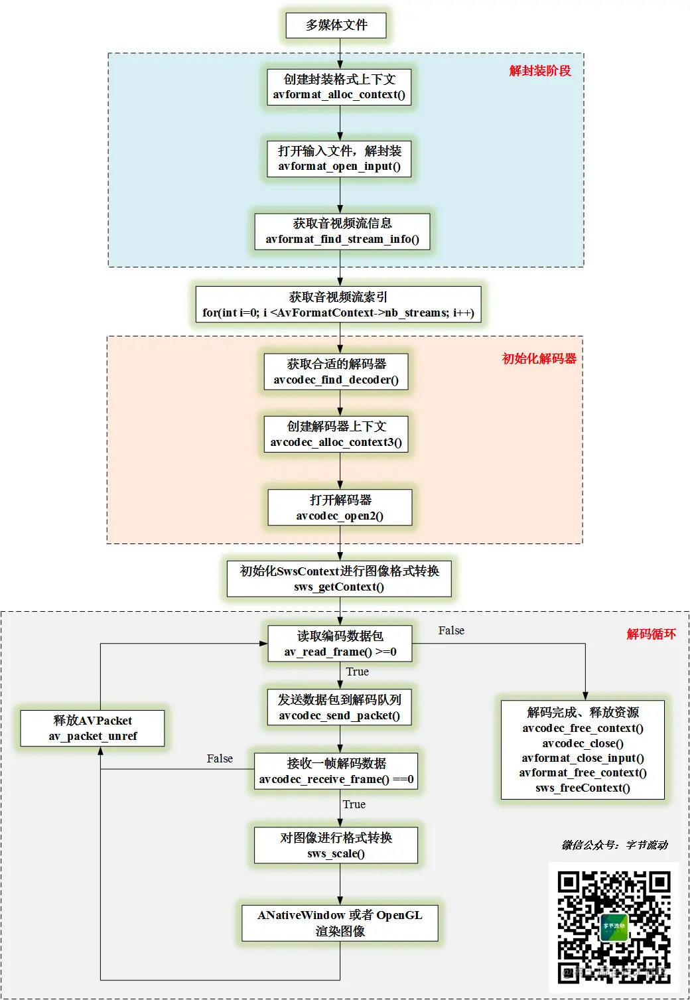

### 学习目标：[FFmpeg + ANativeWindow 实现视频解码播放](https://juejin.cn/post/6845166891661525005)

### 关于 FFmpeg 需要了解的几个结构体：

* AVFormatContext：解封装功能的结构体，包含文件名、音视频流、时长、比特率等信息；
* AVCodecContext：编解码器上下文，编码和解码时必须用到的结构体，包含编解码器类型、视频宽高、音频通道数和采样率等信息；
* AVCodec：存储编解码器信息的结构体；
* AVStream：存储音频或视频流信息的结构体；
* AVPacket：存储音频或视频编码数据；
AVFrame：存储音频或视频解码数据（原始数据）；

